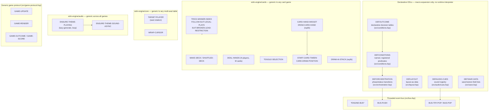
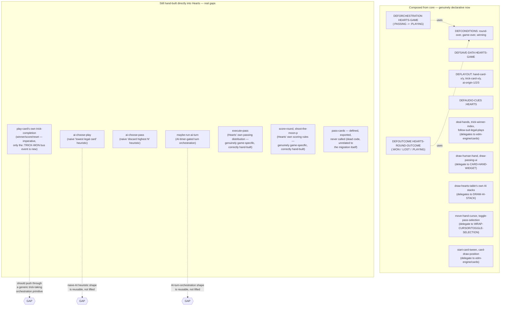

# Engine vs. per-table architecture — Hearts audit, template for the rest of #64

Status: audit of real, current code as of `a405589`, not a proposal.
Every box in both diagrams corresponds to a real file/function that
exists right now — nothing speculative. Written per direct request,
after confirming (per direct question) that Hearts' own migration
was *not* complete before this — the gap table below is the honest
answer to that question, not a retrospective gloss.

## Diagram 1 — the engine's own core, shared layer

## Diagram 2 — Hearts today: what's declarative vs. what's still hand-built

## Gap table — what should be a core provider instead of hand-built into Hearts

**Update, post-audit: all three items below are now closed** (`ec8cc78`, `abc49a0`, `a630f3c`) — kept in the table with their real resolution noted, not deleted, so the audit's own before/after is visible rather than silently rewritten.

| Currently in Hearts | Should live in | Why | Status |
|---|---|---|---|
| `play-card`'s trick-completion (winner/score/reset/next-leader) | A generic trick-taking orchestration primitive in `edm-engine/cards` | The whole *sequence* (advance turn, or on the 4th card: determine winner via the already-generic `TRICK-WINNER-INDEX`, score it, reset, set next leader) is the same shape for Spades/Bridge/Euchre — only the scoring function (`CARD-POINTS`) is genuinely game-specific. Currently 100% imperative in `game.lisp`, only patched with a bus-push this turn, not restructured. | **Closed (`a630f3c`)** — `TRICK-COMPLETE-P`/`RESOLVE-COMPLETED-TRICK` |
| `ai-choose-play` (lowest-legal-card heuristic) | A generic naive-AI heuristic in `edm-engine/cards` or a new `edm-engine/ai-heuristics` | "Play the lowest legal card" is a reusable, genuinely game-agnostic naive strategy for any trick-taking game, not a Hearts-only idea. | **Closed (`ec8cc78`)** — `LOWEST-RANK-CARD` |
| `ai-choose-pass` (discard-highest-N heuristic) | Same as above | "Discard your N highest-value cards" is the same reusable shape. | **Closed (`ec8cc78`)** — `HIGHEST-N-CARDS` |
| `maybe-run-ai-turn` (AI-timer-gated turn dispatch) | A generic AI-turn-orchestration primitive, composing the existing `edm-engine:ai-timer-*` infrastructure | The *outer* shape ("if it's not my turn and the AI-timer says ready, run a decision→animate→act sequence") is generic; only the decision/animate/act functions passed in are Hearts-specific. Needs a real callback-based redesign, not a naive copy — correctly the lowest priority of this whole catalog. | **Closed (`abc49a0`)** — `RUN-AI-TURN-WHEN-READY`, designed against Yahtzee's own already-existing, identical shape as a second real consumer, not Hearts alone |
| `pass-cards` | N/A | Genuinely dead code — defined, exported, never called anywhere. Not a migration gap, just needs removing. | **Open — unrelated cleanup** |
| `execute-pass`'s card-distribution logic | Stays in Hearts | Hearts' own passing mechanic isn't shared by Spades/Bridge/Euchre at all — correctly hand-built, not a gap. | **Correctly scoped** |
| `score-round` / `shoot-the-moon-p` | Stays in Hearts | Hearts' own scoring rules (shoot-the-moon is Hearts-only). Correctly hand-built. | **Correctly scoped** |

## What "complete" actually requires, stated plainly

Per the direct question this audit originally answered: Hearts was
**not** completely migrated at the time this doc was first written.
As of `a630f3c`, all three named gaps are genuinely closed — `DEFOUTCOME`
landed, the trick-completion bus gap and its own imperative sequence
are both resolved, and the two naive-AI heuristics plus `RUN-AI-TURN-
WHEN-READY` are lifted (the latter designed against Yahtzee's own
already-existing, identical shape as a real second consumer, not
Hearts alone). This table is the honest record of that becoming true,
not a claim made in advance of the work.

## For the rest of #64 — applying this to Queens/Wordle/Yahtzee faster

This audit's own method, reusable directly:
1. `grep` every game's own `game.lisp`/`render.lisp` for direct
   `bus-push`/inline `cond`/`case` branching on status or phase —
   anywhere a real state transition exists without going through
   `DEFORCHESTRATION`/`DEFOUTCOME` is a gap, the same way Hearts'
   own trick-completion and round-over/game-over were found.
2. Cross-reference every remaining hand-written function against
   `edm-engine/cards`'s and `edm-engine/core`'s own current export
   lists first — several of Queens/Wordle/Yahtzee's own functions
   likely already have a generic home waiting (e.g. any of them still
   hand-rolling cursor-wrap or a naive-AI shape).
3. `ensure-theme-playing`'s own finding — genuinely duplicated
   byte-for-byte across all four games before this session's own
   lift — is a strong prior: assume other, not-yet-audited
   duplication exists across the other three games until checked
   directly, not assumed absent.

Filed as its own tracked issue (see repository) so this doesn't get
re-discovered piecemeal per game.
