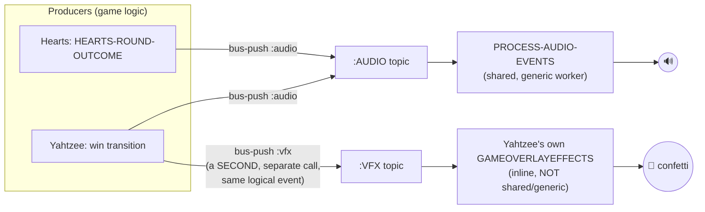
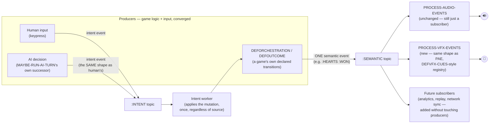

# Target architecture: one semantic event bus, independent workers, converged AI/human intent

Status: design proposal, not implemented. Written per direct
instruction, after reviewing `docs/systemic-event-bus-architecture.md`
and `docs/orchestration-dsl-design.md` first — this doc is their
natural continuation, not a break from them. Grounded in real,
current code, checked directly, not assumed.

## Three real findings that motivate this, all checked directly

**1. `process-audio-events` handles 24 event sites across 7 files
today** — every `bus-push ... :audio` call in `src/`, counted
directly, not estimated. It is correctly scoped to audio specifically
(it resolves a cue name to a tone and plays it) — the problem isn't
that it does too much, it's that **nothing else shares the event it's
draining.**

**2. `deforchestration` — the core orchestration macro — hardcodes its
generated transitions to push to `:audio` specifically**, not a
generic semantic topic. `src/orchestration.lisp`'s own expansion:
`(bus-push *engine-bus* :audio (list ,@bus-event))`. Every game's own
outcome (`hearts-round-outcome`, `queens-level-outcome`) is real
DSL-declared data — but the *only* consumer that data can ever reach,
by construction, is audio. A future VFX/analytics/network-sync
consumer wanting to react to "Hearts was won" has no bus topic to
drain; the DSL itself doesn't produce one for it.

**3. `:vfx` exists as a second, real topic — but has no shared worker
at all.** Confirmed directly: exactly one push site (Yahtzee's own
win transition) and exactly one drain site (Yahtzee's own
`GameOverlayEffects`, draining inline, not via a generic mechanism
matching `defaudio-cues`/`process-audio-events`'s own established
shape). The result: for the identical logical fact ("Yahtzee was
won"), the game's own code has two separate `bus-push` calls at the
same call site — one to `:audio`, one to `:vfx` — because the
producer has to know which consumers exist and address each one
directly. That's the actual leaky abstraction: **game logic should
emit that something happened, not know who's listening.**

This is precisely what `docs/systemic-event-bus-architecture.md`
already named as the target ("a declarative mapping from semantic
event to tone/pattern for audio, to layout position for rendering, to
effect sequence for VFX") — checked directly against what was actually
built, and confirmed as a real, current gap, not resolved by this
session's own DSL work so far.

## Diagram — current state (confirmed by direct inspection)

## Diagram — target state

## The two real, separable pieces

### Piece 1: one semantic topic, many independent subscribers

`deforchestration`/`defoutcome`-driven transitions push to a single,
generic `:semantic` topic (event shape: `(:game GAME :event NAME)`,
already close to today's `(:game :hearts :cue :won)` shape — this is
a rename/generalization, not a redesign). `process-audio-events`
becomes one subscriber among several, unchanged in its own logic — it
already only cares about resolving a `(game . cue)` pair, which
doesn't need to know the topic is now shared. A new, symmetric
`defvfx-cues`/`process-vfx-events` (same registry-macro shape as
`defaudio-cues`/`process-audio-events`, proven three times already
this session for shaders/audio/theme-sound) becomes Yahtzee's real
target, replacing its own inline `GameOverlayEffects` drain — and
becomes available to Hearts/Queens/Wordle's own win transitions for
free, without those games' own code needing to know VFX exists.

This directly fixes finding #2 and #3 above: the producer (a game's
own `deforchestration` declaration) stops needing to know which
consumers exist. It emits one fact; however many workers are
subscribed react independently.

### Piece 2: AI and human input converge on the same intent channel

Per direct confirmation this was the original concept: today,
`maybe-run-ai-turn`'s own decision (`ai-choose-play`, etc.) and a
human's `key-enter` press both end up calling the same mutating
function (`play-card`, `cycle-cell-at-cursor`) — but one path is a
direct call from an AI callback, the other a direct call from
raylib's own input-polling code. Both are real, valid inputs to "what
should happen this frame" — they're just not expressed as the same
kind of thing today.

Target: both become the same shape — an intent event (`(:game GAME
:intent NAME :args ...)`) — pushed to a shared `:intent` topic. One
worker drains it and applies the mutation, regardless of whether the
intent came from a human keypress or an AI's own decision function.
This is a genuine, valuable unification, not decoration: it means
"what can happen in this game" and "how it happens" become fully
separable — a future replay system, a future network-multiplayer
mode, or a future difficulty-tier AI can all be built as alternate
intent *producers*, without touching the mutation logic itself at
all.

## What this is not, stated per the same discipline as prior docs

Not a call to rewrite everything in one pass — matching
`docs/systemic-event-bus-architecture.md`'s own stated discipline.
The concrete, bounded first step: extend `deforchestration`'s own
macro-expansion to push to a generic topic name (a real, small,
backward-compatible change — existing `:bus-event` declarations keep
working, `process-audio-events` keeps subscribing to what becomes
one of several event types on that topic), then build `defvfx-cues`
as the second, proving consumer, retrofitting Yahtzee's own
`GameOverlayEffects` first (a real, already-existing second
consumer, not hypothetical) before generalizing further. The intent-
channel convergence (piece 2) is real, separable, follow-on scope —
not bundled into the same implementation pass as piece 1.

## Scope, for whoever picks this up

1. Rename/generalize `deforchestration`'s own hardcoded `:audio` push
   to a genuine `:semantic` topic (or similar), keeping the event
   shape close to today's for minimal churn.
2. Build `defvfx-cues`/`process-vfx-events`, proven against Yahtzee's
   own real `:yahtzee-won` VFX trigger as the first real retrofit —
   not built speculatively.
3. Confirm `process-audio-events` needs no logic change, only to keep
   subscribing to whatever the renamed/shared topic becomes.
4. Design the intent-event shape and the one shared intent-draining
   worker (piece 2) as its own, separate, later design pass — informed
   by having piece 1 actually built and proven, not designed
   speculatively alongside it.
