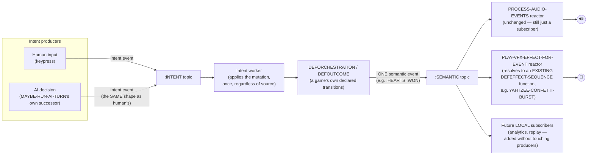
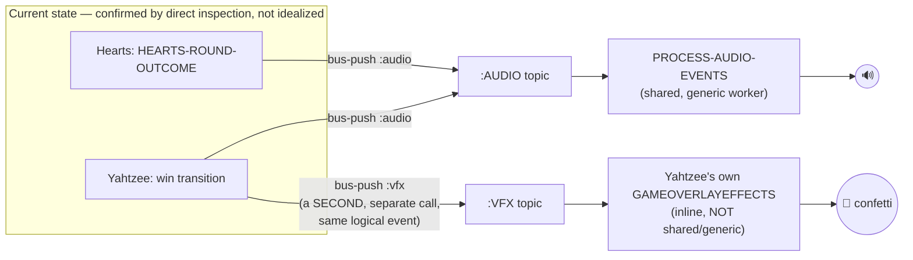

# Target architecture: one semantic event bus, independent workers, converged AI/human intent

Status: design proposal, not implemented. Written per direct
instruction, after reviewing `docs/systemic-event-bus-architecture.md`
and `docs/orchestration-dsl-design.md` first — this doc is their
natural continuation, not a break from them. Grounded in real,
current code, checked directly, not assumed.

## Three real findings that motivate this, all checked directly

**1. `process-audio-events` handles 24 event sites across 7 files
today** — every `bus-push ... :audio` call in `src/`, counted
directly, not estimated. It is correctly scoped to audio specifically
(it resolves a cue name to a tone and plays it) — the problem isn't
that it does too much, it's that **nothing else shares the event it's
draining.**

**2. `deforchestration` — the core orchestration macro — hardcodes its
generated transitions to push to `:audio` specifically**, not a
generic semantic topic. `src/orchestration.lisp`'s own expansion:
`(bus-push *engine-bus* :audio (list ,@bus-event))`. Every game's own
outcome (`hearts-round-outcome`, `queens-level-outcome`) is real
DSL-declared data — but the *only* consumer that data can ever reach,
by construction, is audio. A future VFX/analytics/network-sync
consumer wanting to react to "Hearts was won" has no bus topic to
drain; the DSL itself doesn't produce one for it.

**3. `:vfx` exists as a second, real topic — but has no shared worker
at all.** Confirmed directly: exactly one push site (Yahtzee's own
win transition) and exactly one drain site (Yahtzee's own
`GameOverlayEffects`, draining inline, not via a generic mechanism
matching `defaudio-cues`/`process-audio-events`'s own established
shape). The result: for the identical logical fact ("Yahtzee was
won"), the game's own code has two separate `bus-push` calls at the
same call site — one to `:audio`, one to `:vfx` — because the
producer has to know which consumers exist and address each one
directly. That's the actual leaky abstraction: **game logic should
emit that something happened, not know who's listening.**

This is precisely what `docs/systemic-event-bus-architecture.md`
already named as the target ("a declarative mapping from semantic
event to tone/pattern for audio, to layout position for rendering, to
effect sequence for VFX") — checked directly against what was actually
built, and confirmed as a real, current gap, not resolved by this
session's own DSL work so far.

## One pipeline, not two separate designs

An earlier draft of this doc split the semantic-event topic and the
intent-channel convergence into "piece 1, do now" and "piece 2,
design later" — a real mistake, corrected here directly rather than
left standing. They're two halves of the same pipeline (intent →
mutation → semantic event → reactions), not independent concerns;
designing one now and the other "later" risks the exact fragmentation
this session has already caught itself doing more than once — a
partial design treated as though the rest is optional, then never
actually revisited. Designed together below as one architecture.
Implementation can still land in stages (semantic-topic generalization
first, since it's the smaller, more mechanical change; intent
convergence second) — but the *design* itself isn't split.

One more precision worth stating plainly, since it's easy to
misread otherwise: "the producer shouldn't need to know who's
listening" is entirely about **local, same-process subscribers** —
confirmed directly, there is no networking code anywhere in this
codebase (`*engine-bus*` is `chanl`'s own intra-process channel
library). Yahtzee's own `:audio`/`:vfx` split is two workers in the
same running Lisp process, not a networked player receiving state
over the wire. A genuinely networked player — needing ordering
consensus across nodes, the kind a Raft-style replicated log solves —
is a real, different, much harder problem this local pub/sub bus does
not address and isn't claimed to. If networked multiplayer is ever
real scope, it needs its own design layered alongside this one, not
assumed to fall out of "one semantic event, many subscribers" for
free.

## The unified pipeline

## The design, in detail

**Real overlap found and reconciled, stated honestly.** An earlier
draft of this section proposed `defvfx-cues`/`process-vfx-events` — a
registry mapping `(game . cue)` to a raw callback, invented without
having read `docs/vfx-style-pipeline-design.md` first. That doc
already designed the actual VFX representation, and — checked
directly, not assumed — most of it is *already implemented*:
`src/effect.lisp`'s own `defeffect-state`/`defeffect-sequence` macros,
`pulseVal`/`ese` (Queens' own cursor pulse, generalized), and
`spawnConfetti`/`particle-effect` (Yahtzee's own win celebration,
arena-backed). `defvfx-cues` would have been a second, competing,
strictly weaker VFX system sitting next to a real one — reverted
entirely, not kept in any form.

**What was genuinely missing, and still is: the dispatch layer.**
`docs/vfx-style-pipeline-design.md`'s own "VFX pipeline" section
describes draining a topic and calling into `*effect-sequences*`/
`*effect-states*` — but today, Yahtzee's own `GameOverlayEffects`
still does this by hand, inline, calling `yahtzee-confetti-burst`
(itself a real `defeffect-sequence`-generated function) directly from
a hand-written drain loop over its own dedicated `:vfx` topic. This is
exactly where the semantic topic fits: not as a replacement for
`defeffect-sequence`/`defeffect-state`, but as the shared dispatch
layer those primitives were always missing. `deforchestration`/
`defoutcome`-driven transitions push to a single, generic `:semantic`
topic (event shape: `(:game GAME :event NAME)`, close to today's
`(:game :hearts :cue :won)` shape). `process-semantic-events` drains
it once per call and fans each event out to every registered reactor
— fixing a real bug found and confirmed directly before this design
settled: `*engine-bus*` is a queue (`chanl`), not a broadcast, so two
independent consumers each separately polling the same topic would
compete for events rather than both receiving them.

Two reactors, both real and proven:

- `play-audio-cue-for-event` — resolves `(game . cue)` against
  `defaudio-cues`' own existing registry, unchanged in its own logic.
- `play-vfx-effect-for-event` — resolves `(game . cue)` against a
  small registry mapping to an *already-existing*
  `defeffect-sequence`/`defeffect-state`-generated function (Yahtzee's
  own `yahtzee-confetti-burst`, proven as the real first retrofit),
  closing over whatever game-specific context (arena, origin,
  rng) that function needs — the registry only resolves *which*
  already-built effect function to call, it doesn't represent effects
  itself.

`process-audio-events` needs no change to its own resolution logic —
it becomes one of `process-semantic-events`' own reactors.

**The intent-convergence half.** Today, `maybe-run-ai-turn`'s own
decision (`ai-choose-play`, etc.) and a human's `key-enter` press
both end up calling the same mutating function (`play-card`,
`cycle-cell-at-cursor`) — but one path is a direct call from an AI
callback, the other a direct call from raylib's own input-polling
code. Both are real, valid inputs to "what should happen this frame"
— they're just not expressed as the same kind of thing today. Target:
both become the same shape — an intent event (`(:game GAME :intent
NAME :args ...)`) — pushed to a shared `:intent` topic. One worker
drains it and applies the mutation, regardless of whether the intent
came from a human keypress or an AI's own decision function.

**Why they're one design, not two.** The intent worker's own output
*is* what triggers `deforchestration`/`defoutcome` in the first
place — an applied intent is what makes a round-over or level-advance
transition become true, which is what produces the semantic event.
Designing the semantic-event shape without knowing what the intent
worker hands it, or designing the intent worker without knowing what
shape its own output needs to be for the orchestration layer to
consume, risks two halves that don't actually fit together — the
exact failure a split design invites.

## What this is not, stated per the same discipline as prior docs

Not a call to rewrite everything in one pass — matching
`docs/systemic-event-bus-architecture.md`'s own stated discipline, and
not a claim that networked multiplayer falls out of this design for
free (it doesn't — see above). The design itself is unified (intent →
mutation → semantic event → reactions, one coherent pipeline), but
implementation still lands in stages, same discipline as every real
lift this session has actually shipped: prove the smaller, more
mechanical piece against a real consumer first, generalize from there.

## Scope, for whoever picks this up

1. Add `process-semantic-events` to `src/bus.lisp` — drains
   `:semantic` once per call, fans each event out to whatever reactor
   functions are given.
2. Rename/generalize `deforchestration`'s own hardcoded `:audio` push
   to `:semantic`, keeping the event shape close to today's for
   minimal churn.
3. Retrofit Hearts'/Queens'/Yahtzee's own `defoutcome`-driven outcome
   pushes (which don't go through `deforchestration` at all — a
   separate mechanism) to push to `:semantic` too, since those are the
   actual `:won`/`:lost`/`:level-advanced` events other systems most
   want to react to.
4. Add `play-audio-cue-for-event` next to `process-audio-events` in
   `src/audio/cues.lisp` — same resolution logic, callable as a
   reactor.
5. Add a small VFX-cue-registry and `play-vfx-effect-for-event`,
   proven against Yahtzee's own real, already-existing
   `yahtzee-confetti-burst` (a `defeffect-sequence` function) as the
   first retrofit — resolving *which* already-built effect to call,
   not representing effects itself; `defeffect-sequence`/
   `defeffect-state` in `src/effect.lisp` remain the actual VFX
   representation, unchanged.
6. Retrofit Yahtzee's own `GameOverlayEffects` to stop hand-draining
   `:vfx` inline — the shared dispatcher replaces it.
7. Design and build the intent-event shape and its one shared,
   draining worker — informed by the semantic-event half already
   being real and proven by this point, not designed in the dark
   before any of it exists, but still the same unified architecture
   from the start, not an afterthought bolted on.

## Cross-reference

Depends on and does not duplicate `docs/vfx-style-pipeline-design.md`
— that doc owns the actual VFX effect representation
(`defeffect-sequence`/`defeffect-state`, arena-backed instances,
already substantially implemented in `src/effect.lisp`); this doc
owns only the event-dispatch layer feeding it, which that doc's own
"VFX pipeline" section named as necessary but left as the one
concretely unbuilt piece.
